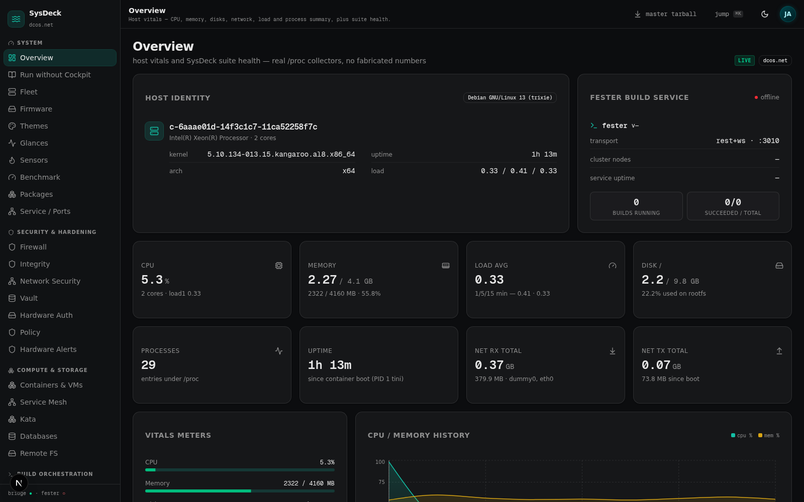
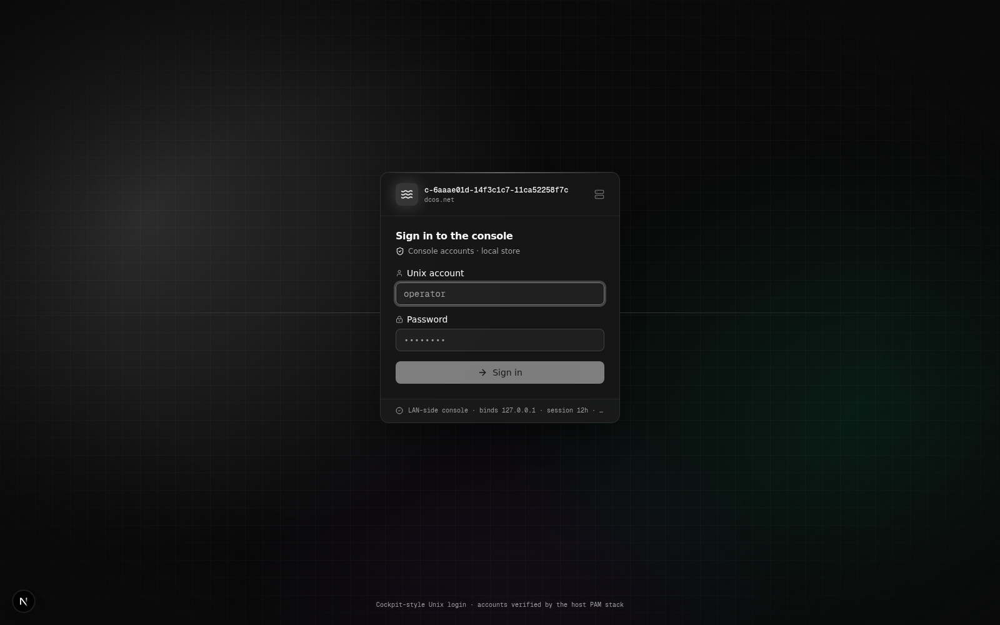
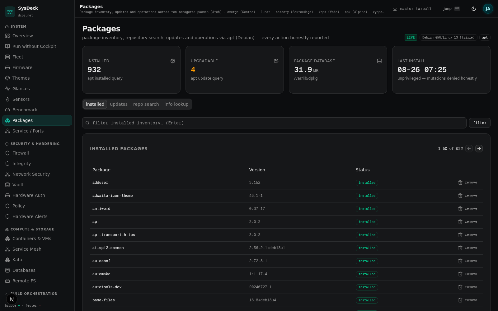
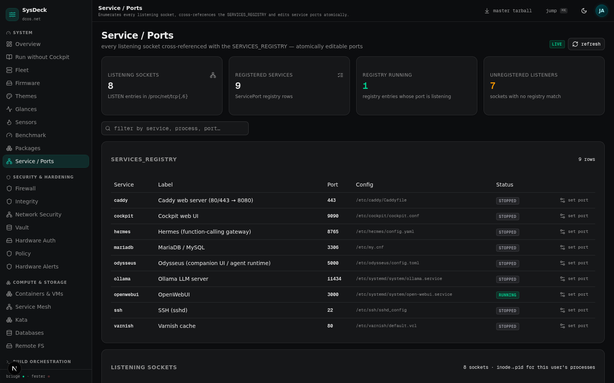
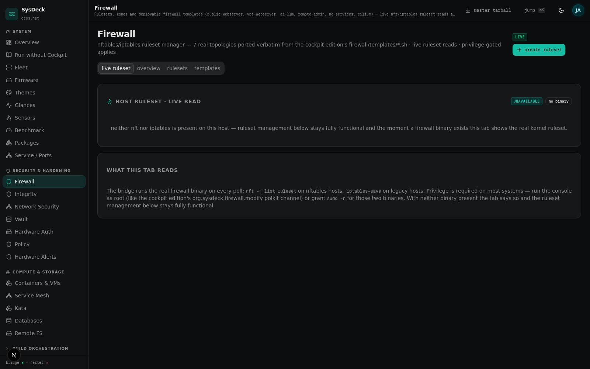

# SysDeck

[](LICENSE)
[](#)
[](https://nextjs.org)
[](https://bun.sh)
[](#)
[](#)

**A standalone Linux operations console — Unix-account login, real host state, no fabricated data. Cockpit is optional: the same module catalog loads there too.**

Author: **Jeremy Anderson** · <info@dcos.net> · <https://dcos.net> · [github.com/dcosnet/SysDeck](https://github.com/dcosnet/SysDeck)
Version: **0.4.5** · License: **MIT**



---

## Table of Contents

- [What this is](#what-this-is)
- [One catalog, two front ends](#one-catalog-two-front-ends)
- [Architecture](#architecture)
- [Module catalog](#module-catalog)
- [The auth model](#the-auth-model)
- [Real host state — the zero-demo contract](#real-host-state--the-zero-demo-contract)
- [Quick start](#quick-start)
- [Configuration](#configuration)
- [Security model](#security-model)
- [Development](#development)
- [Coding standards](#coding-standards)
- [Documentation map](#documentation-map)
- [License](#license)

---

## What this is

SysDeck is a browser-native operations console for Linux servers. One process serves **thirty-one panels** — containers, firewall, integrity auditing, network security, encryption vaults, fleet compute, Kata sandboxes, firmware, image building, mining, sensors, benchmarking, package management across ten package managers, policy and permissions, database control, media servers, photo libraries, remote filesystems, DAG build orchestration, and the AI gateway — and every panel reads the host as it actually is: `/proc` and `/sys` collectors, `systemctl`, `lsblk`, `nft`, the real package manager, live service APIs. Nothing in the codebase is demo, mock, or seeded; when a backend is absent the panel says so and shows install guidance.

You sign in with your **Unix account** — the username and password are verified by the host's own PAM stack, exactly the mechanism Cockpit uses at its own login screen. The host decides; the console keeps no password data of its own. Sessions are user-bound HMAC cookies, login failures are rate-limited per-IP and per-username, and mutating commands require an admin session by default.

The console is a **complete standalone application**: one Next.js process, a bundled SQLite store, the vendored Fester build orchestrator as a sidecar service. No Cockpit, no Python bridge, no systemd, no root — it runs as an unprivileged user on any Linux host. If Cockpit *is* on the box, the console detects every installed cockpit module and loads it into its own navigation.

The same module catalog also ships as a **Cockpit plugin suite** — 27 standalone plugins plus a Python bridge package that install under `/usr/share/cockpit/sysdeck-*/` and appear in the Cockpit sidebar. This is now the optional deployment shape: for operators already running Cockpit, the suite drops in and rides the cockpit superuser/polkit channel for privilege. One catalog, two front ends, zero drift between them.

## One catalog, two front ends

| Shape | Use case | Lives at |
|-------|----------|----------|
| **Standalone web console** (default) | Run the whole console in the browser — no Cockpit on the host at all | `web/` · one process on `:3000` |
| **Cockpit plugin suite** (optional) | Drop the same 27 domain modules into an existing Cockpit install | `/usr/share/cockpit/sysdeck-*/` · `https://<host>:9090` |
| **Master tarball** | Both shapes + vendored services in one bundle | `sysdeck-0.4.5-master.tar.bz2` (`make master`) |

The parity rule runs both directions. Every domain module in the console has a counterpart plugin in `plugins/sysdeck-*/`, and the packages module, for instance, runs the same ten-manager step-down (pacman, emerge, lunar, sorcery, xbps, apk, zypper, dnf/yum, apt) with the same parsers and fixture tests on both sides. The console additionally detects every *installed* cockpit module on the host — distro modules like cockpit-machines and cockpit-podman, addons, anything with a `menu` entry in its manifest — and loads each into its own sidebar. Install a cockpit module on the box, and it shows up in the console; no cockpit login required to browse it.

## Architecture

```
                       one module catalog
                              │
        ┌─────────────────────┴──────────────────────┐
        │                                            │
  web console (default)                    Cockpit plugin suite (optional)
  web/ · Next.js 16 · React 19 · Bun        plugins/ · 27 static plugins
  one process on :3000                      /usr/share/cockpit/sysdeck-*/
        │                                            │
  /api/bridge dispatcher                    cockpit.spawn { superuser: 'try' }
  31 TS bridge modules                     28 Python bridge helpers
  web/src/lib/sysdeck/bridge/              bridge/ → /usr/lib/sysdeck/bridge/
        │                                            │
        └─────────────────────┬──────────────────────┘
                              ▼
                 the host as it actually is
   /proc · /sys · systemctl · lsblk · ss · nft/iptables ·
   sensors -j · pacman/apt/dnf/zypper/emerge/xbps/apk… ·
   podman · virsh · kubectl · fwupd · fail2ban · XMRig · REST APIs
```

```
sysdeck/
├── web/                       # the standalone console (the default front end)
│   ├── src/lib/sysdeck/       # 31 bridge modules + registry + shell + session
│   ├── src/app/               # App Router: login gate + /api/{bridge,auth,fester,release}
│   ├── mini-services/fester/  # vendored DAG build orchestrator (own version, :3010)
│   └── scripts/               # pam-auth.py · manage-users.mjs · make-master-tarball.sh
├── plugins/                   # 27 Cockpit plugins (the optional front end)
├── shared/                    # bridge.js + sysdeck.css + sysdeck-web.css (cockpit side)
├── bridge/                    # 28 Python bridge helpers → /usr/lib/sysdeck/bridge/
├── klanker-gate/              # vendored LLM gateway (TykoDev, Apache-2.0 — not SysDeck code)
├── firewall/                  # 7 nftables templates + cilium policy
├── prometheus/                # prometheus + grafana provisioning configs
├── packaging/                 # PKGBUILD · RPM spec · debian/ · setup.py · polkit · metainfo
├── compat/                    # per-distro dependency matrix
├── standalone-plugins/        # sidebar registrations for external cockpit plugins
├── tests/                     # parser fixtures + build-time guards (make check)
├── scripts/                   # generate-plugins.py + fixture runner
├── docs/                      # INSTALL.md · SECURITY-HARDENING.md
└── Makefile                   # install / check / dist / master / web-dev
```

### Bridge layers

Both front ends reach the system through a bridge layer — never directly from the browser.

| Layer | Web console | Cockpit edition |
|-------|-------------|-----------------|
| Transport | `/api/bridge` route: module+command allowlist, 256 KB body cap, per-IP token bucket | `cockpit.spawn` with `{ superuser: 'try' }` — the cockpit way |
| Helpers | 31 TypeScript modules, `web/src/lib/sysdeck/bridge/` | 28 Python helpers, invoked by absolute path `python3 /usr/lib/sysdeck/bridge/<module>.py <sub>` |
| Resilience | TTL + single-flight caches shared across panels; fixed-argv spawns, scrubbed env, hard timeouts | Same disciplines, Python side |
| Permission | Mutations require an admin session (wheel/sudo/adm or uid 0); `SYSDECK_MUTATIONS=any` for single-operator consoles | polkit actions in `org.sysdeck.policy` (14 domains) + `org.sysdeck.modules3p.policy` |

Every spawn uses the array form with an allowlisted command set — no `eval`, no `Function` constructor, no untrusted input reaching a shell. Credentials and privileged payloads ride stdin, never argv, so `/proc/<pid>/cmdline` cannot leak them to other local users.

### Cross-cutting contracts

- **Cockpit manifest.** Each plugin's `manifest.json` registers under the `index` menu key; cockpit serves the page at `/cockpit/@localhost/sysdeck-<name>/index.html`. The web console discovers the same modules from its own registry.
- **Module registry.** `scripts/generate-plugins.py` is the declarative source for the plugin catalog; `web/src/lib/sysdeck/registry.ts` is the console's counterpart. Adding a module means appending an entry and dropping a plugin directory — no other wiring.
- **Zero-demo envelope.** Every bridge response is `{ ok, data, source, note }` where `source` is `'live' | 'hybrid' | 'unavailable'` — the TypeScript union admits no `'demo'` value, so the compiler rejects one at build time.

## Module catalog

27 domain modules run in **both** front ends. The web console adds four panels of its own (Overview landing, the Run without Cockpit runbook, Hardware Alerts, and the Cockpit Modules hub) for 31 total.

### System

| Panel | What it reads / does |
|-------|----------------------|
| Overview *(console)* | Host vitals — CPU, memory, disks, network, load, process summary, suite health |
| Run without Cockpit *(console)* | The standalone deployment runbook, in-console, with copy buttons |
| Fleet | Node registry and live host metrics |
| Glances | Live cross-domain monitor; embeds the Glances web UI + snapshot cards |
| Sensors | `sensors -j` (lm-sensors) with raw `/sys/class/hwmon` / thermal-zone fallback |
| Benchmark | CPU / memory / disk micro-benchmarks with score history |
| Packages | Ten managers: pacman · emerge · lunar · sorcery · xbps · apk · zypper · dnf/yum · apt |
| Firmware | fwupd inventory, DMI identity, TPM PCR boot chain |
| Themes | Live-switch the whole suite between console themes |
| Service / Ports | Every listening socket, cross-referenced against a services registry; atomic port edits + restart |

### Security & Hardening

| Panel | What it reads / does |
|-------|----------------------|
| Firewall | Live nft/iptables ruleset reads; seven deployable templates (public-webserver, vps-webserver, ai-llm, remote-admin, no-services, cilium, sysdeck-fw) with privilege-gated applies |
| Integrity | Tripwire-style baseline / drift detection + lynis hardening index |
| Network Security | Kernel-source connection states, listening surfaces, real ban enforcement (nftables blacklist set or iptables DROP) merged with the live fail2ban list, port sweeps |
| Vault | LUKS volumes from `lsblk`; keyfile / TPM-sealed secret entries |
| Hardware Auth | PKCS#11 smartcard readers, certificates, hardware tokens |
| Policy | LSM stack (AppArmor/Smack/TOMOYO/Yama/LoadPin/Lockdown/BPF-LSM/Landlock), ACLs, cgroups v2, VLANs, eBPF, namespaces, file capabilities |
| Hardware Alerts *(console)* | Foreign-device detection — USB storage, Thunderbolt DMA, rogue bluetooth, new PCI, firmware tamper |

### Compute & Storage

| Panel | What it reads / does |
|-------|----------------------|
| Containers & VMs | Incus / LXC / Podman / libvirt / Firecracker inventory + lifecycle actions |
| Service Mesh | Kubernetes services, deployments, pods across namespaces |
| Kata | Kata Containers confidential-compute sandboxes |
| Remote FS | Ceph / GlusterFS / MooseFS / BeeGFS / OrangeFS registries, mount/unmount/heal |
| Databases | 32+ engines across SQL, NoSQL, vector, time-series, graph, embedded, AI — start/stop/backup, read-only SQL queries |

### Build Orchestration

| Panel | What it reads / does |
|-------|----------------------|
| Fester | Distributed DAG builds via the vendored :3010 service — live event stream, replay, autopsy, causal graph, step debugger |
| Image Builder | mkosi / vmdb2 / archiso / live-build profile management, package lists, build runs, artifacts |
| Mining | Rig fleet, per-GPU hashrate and thermal watch — live XMRig API + nvidia-smi |

### Media

| Panel | What it reads / does |
|-------|----------------------|
| Jellyfin | Media server library and active sessions; service control + admin UI |
| Photos | PhotoPrism / Piwigo / Lychee / Nextcloud-Memories / LibrePhotos libraries |

### Integrations

| Panel | What it reads / does |
|-------|----------------------|
| Monitoring | Prometheus + Grafana probes, with a native ring-buffer metrics fallback when absent |
| 3rd-Party Modules | In-suite installer for third-party Cockpit modules (45Drives Navigator/File-Sharing/ZFS-Manager, cockpit-pacman, cockpit-identities, …) with inline license disclosure |
| AI Gateway | klanker-gate ("Frosty Deno", by TykoDev — not SysDeck code) client: providers, virtual keys, request logs, spend; live local-backend probes (ollama, llama.cpp, KoboldCpp, LM Studio, SGLang, vLLM) |
| Cockpit Modules *(console)* | Every cockpit module detected on the host — manifest identity, shipped files, live backend presence probes, jump to the native panel covering the domain |

Each domain module fails closed when its backend tool is absent — the panel shows an install hint instead of crashing.

## The auth model

The console owns no account system. `web/scripts/pam-auth.py` is a stdlib-only ctypes client of `libpam` that runs `pam_start` → `pam_authenticate` → `pam_acct_mgmt` under the `sysdeck` service when `/etc/pam.d/sysdeck` exists, else the stock `login` stack. Credentials travel over stdin as one JSON document — never argv. Ship your own `/etc/pam.d/sysdeck` to tailor the stack (MFA modules included, if you want them).



Three auth modes cover the deployment shapes: `SYSDECK_AUTH_MODE=pam` (default, cockpit-faithful — run the service as root so any Unix account can sign in), `pam+local` (PAM first, locally-stored scrypt accounts as the fallback for unprivileged installs), and `local` (console accounts only, managed with `bun scripts/manage-users.mjs list|add|passwd|disable|enable|remove`).

Sessions are HttpOnly, SameSite=Lax cookies (`sd_session`) holding an HMAC-SHA256-signed token bound to the username — `v2.<exp>.<userB64url>.<hmac>`, 12 h expiry, per-install key persisted in SQLite so sessions survive restarts and the Fester service verifies the identical token on its own REST + WebSocket surface. Login failures are rate-limited per-IP and per-username (5/min each); wrong-user and wrong-password return the same generic answer, so nothing enumerates accounts.

## Real host state — the zero-demo contract

Every module ships a production implementation only. The bridge envelope's `DataSource` type is three strings wide — `'live' | 'hybrid' | 'unavailable'` — and the compiler rejects any reintroduction of a `'demo'` value. A host with no sensors gets an honest empty inventory, never a made-up chip set; a host with no XMRig daemon says so and shows install guidance. Bans are enforced through a real atomic nftables batch (`table inet sysdeck`, 30-day timeouts) or an iptables `INPUT DROP` rule, and the live fail2ban ban list is merged when fail2ban runs. LUKS header backups are hashed from the actual image bytes, verifiable with `sha256sum` on the command line. The firewall panel renders the host's actual kernel ruleset (`nft -j list ruleset` / `iptables-save`), refreshed live.

Live rows where the backend exists, honest empties where it does not — both from the same session:

| Packages — 932 real apt rows | Service / Ports — every listening socket |
|---|---|
|  |  |

| Firewall — the honest empty (no nft on this host) |
|---|
|  |

## Quick start

### Standalone console (default — no Cockpit required)

```bash
tar xjf sysdeck-0.4.5-master.tar.bz2
cd sysdeck-0.4.4-master
make web-dev        # bun install + db:push + fester (:3010) + next dev (:3000)
```

Open `http://localhost:3000` and sign in with a Unix account. Prerequisites: Bun ≥ 1.1 (Node-only hosts work too), ~200 MB disk, ~512 MB RAM. Not required: Cockpit, systemd, Docker, root. The production path — standalone build, the two systemd units, the `.env` reference, reverse proxy with the `?XTransformPort=` websocket gateway, troubleshooting — is [`web/README.md`](./web/README.md), shipped in-console as the "Run without Cockpit" panel.

### Cockpit plugin suite (optional)

```bash
cd sysdeck-0.4.4-master
sudo make install
sudo systemctl restart cockpit.socket
# open https://<host>:9090 → 27 "SysDeck <Name>" entries appear in the sidebar
```

Prerequisites: `cockpit-bridge` ≥ 239, `python3` ≥ 3.9, `polkit`. The five-minute version of both paths is [QUICKSTART.md](./QUICKSTART.md); the full install matrix (Make, RPM, pip, staged overlay) is [docs/INSTALL.md](./docs/INSTALL.md).

## Configuration

Key environment variables (web console — full reference in `web/README.md` §5):

| Variable | Default | Meaning |
|----------|---------|---------|
| `SYSDECK_AUTH_MODE` | `pam` | `pam` (host PAM only) · `pam+local` (PAM first, scrypt fallback) · `local` (console accounts) |
| `SYSDECK_PAM_SERVICE` | `sysdeck` | PAM service name; falls back to the `login` stack when `/etc/pam.d/sysdeck` is absent |
| `SYSDECK_MUTATIONS` | `admin` | Mutating bridge commands require an admin session; `any` restores the single-operator posture |
| `SYSDECK_SESSION_SECURE` | off | Add the `Secure` cookie flag when fronted by TLS |
| `SYSDECK_TRUST_PROXY` | off | `X-Forwarded-For` defines rate-limit identity only behind an opted-in proxy |
| `SYSDECK_COCKPIT_SCAN` | — | Extra scan roots (colon-separated) for cockpit-module detection |
| `KLANKER_URL` / `KLANKER_ADMIN_TOKEN` | `http://127.0.0.1:8080` | Point the AI Gateway panel at a running klanker-gate |
| `DATABASE_URL` | `file:../db/custom.db` | SQLite store for sessions, audit log, module state |

## Security model

The console is a LAN-side tool — loopback binding stays the outer boundary; front it with TLS and set `SYSDECK_SESSION_SECURE=1` for anything beyond. Privileged writes ride stdin and verify themselves (polkit rules byte-for-byte after write; `nft -f -` / `iptables-restore` piped rulesets; `mktemp` staging everywhere `/tmp` was predictable). Dry-runs preview exactly what apply executes; unbans and template applies report the firewall's real exit code. The design lessons — drawn from Webmin, Cockpit, and admin-panel CVE history — are recorded in [docs/SECURITY-HARDENING.md](./docs/SECURITY-HARDENING.md), mapped finding-to-fix.

## Development

```bash
make check         # 7 build-time guards + 267 parser unit tests
make dist          # cockpit tarball (runs check first)
make distcheck     # extract the tarball into a clean dir, run check inside
make master        # master tarball: cockpit + web + fester + klanker-gate
make web-dev       # run the web console locally
```

The guards cross-check what drift would otherwise break: every `bridgeCmd()` call in `shared/bridge.js` against the `COMMANDS` dict in each Python helper, every plugin manifest against the cockpit-podman reference pattern, version sync across the release surfaces, the forbidden `import cockpit from` and `python3 -m sysdeck.bridge` patterns, and Makefile recipe indentation. The web side holds the same bar: `bun run lint` and `tsc --noEmit` clean.

## Coding standards

The codebase follows four reference standards, adapted to TypeScript/JavaScript/Python:

- **PEP 868 (spirit).** 4-space indentation in Python; 2-space in JS; trailing commas in multi-line literals. Type annotations on every public Python function.
- **POSIX.** Each function does one thing. Compose with pipes (event bus), not with hidden side effects. No function returns more than one type.
- **SEI CERT.** No `eval`, no `Function` constructor, no untrusted input reaching `spawn` without an allowlist. All spawns use the array form.
- **MISRA (spirit).** Limited cyclomatic complexity per function. Single exit point where practical. No heap allocation in render hot paths.

### Refactor discipline

When modifying code, prefer in this order:

1. **Lookup table** — if the construct is a status-to-X mapping, use a `Record<string, X>` (JS) or `dict` / list-of-tuples (Python). The policy module uses `LSM_PROBES`, `NON_LSM_CONCERNS`, `SMACK_FILE_MAP`, `TOMOYO_FILES`, and `YAMA_SCOPE_NAMES` for exactly this reason — adding a new LSM is one line in the table, not a new code path.
2. **Functional iterator** — `map` / `filter` / `reduce` / `flatMap` over `for` or `while`.
3. **Early return** — flatten nested `if` with guard clauses.
4. **Switch** — only when the case set is closed and a lookup table would be less readable.

When a fork of choices appears, apply **step-down logic**: pick the option that composes best with the rest of the system (Unix philosophy), document the decision in a comment, and move on.

### Comments

Code comments state decisions, not history. Use them to record *why* a non-obvious choice was made. Every comment should sound like a decisive decision.

## Documentation map

| Document | What it holds |
|----------|---------------|
| [QUICKSTART.md](./QUICKSTART.md) | The five-minute paths: standalone console first, cockpit plugin second |
| [docs/INSTALL.md](./docs/INSTALL.md) | The install matrix: standalone, Make, RPM, pip, staged overlay |
| [web/README.md](./web/README.md) | The complete standalone runbook (also shipped in-console as the Run without Cockpit panel) |
| [BLOG.md](./BLOG.md) | The engineering essay — auth model, one catalog two front ends, zero-demo contract |
| [docs/SECURITY-HARDENING.md](./docs/SECURITY-HARDENING.md) | CVE-to-fix mapping from Webmin/Cockpit/admin-panel history |
| [QA.md](./QA.md) | Per-release QA records |
| [worklog.md](./worklog.md) | Per-task development log |
| [THIRD_PARTY.md](./THIRD_PARTY.md) | Third-party attributions (incl. the vendored klanker-gate) |

## License

MIT — see [LICENSE](./LICENSE). Third-party attributions: [THIRD_PARTY.md](./THIRD_PARTY.md). The vendored klanker-gate gateway is by TykoDev (Apache-2.0) — not SysDeck code; see `klanker-gate/ATTRIBUTION.md`.

Author: Jeremy Anderson (<info@dcos.net>, <https://dcos.net>). Release history: [QA.md](./QA.md) and [worklog.md](./worklog.md) hold the per-version records.
