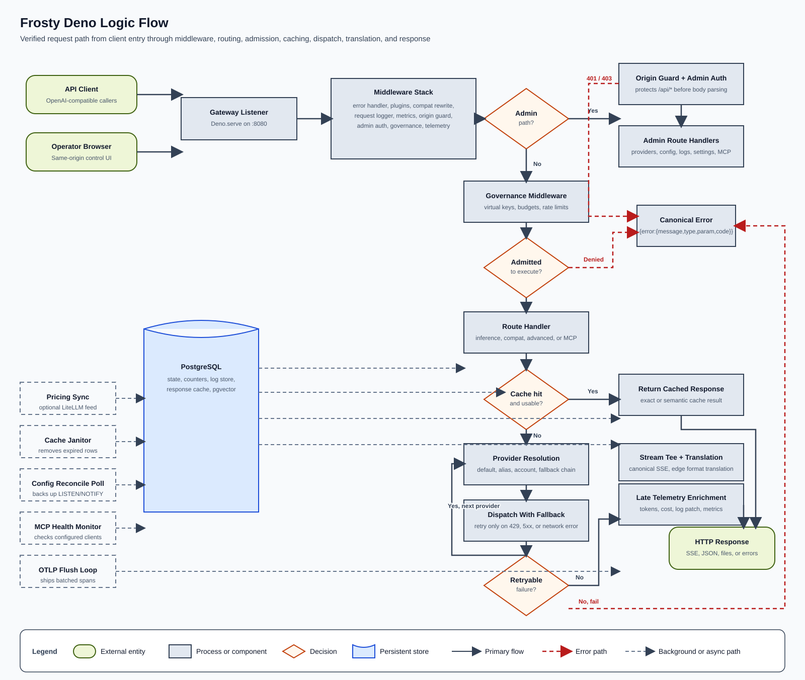
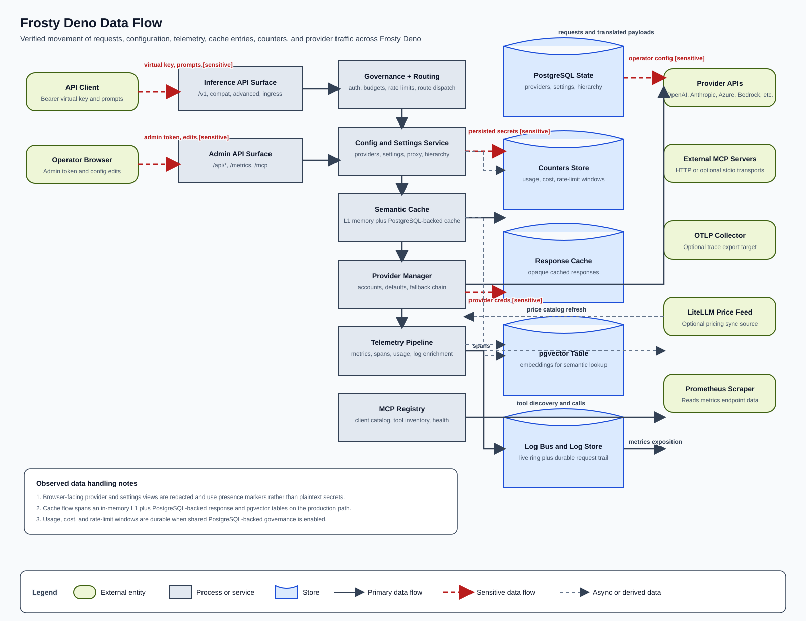
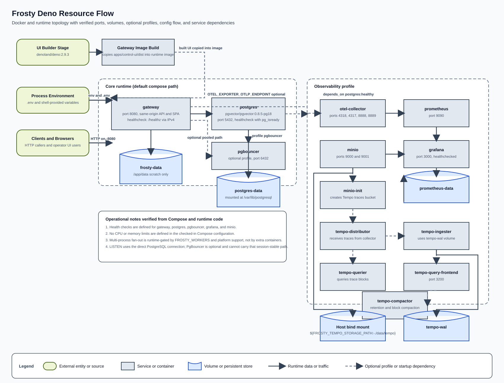

# Architectural Overview

Frosty Deno is a Deno 2 + TypeScript LLM gateway that combines three roles in
one process boundary:

- an OpenAI-compatible inference gateway,
- a same-origin operator control plane,
- an MCP client and MCP server surface.

The production path is assembled in `apps/gateway/context.ts` and served by
`apps/gateway/main.ts`. Durable state is centralized in PostgreSQL. The React
control plane is built into `apps/control-ui/dist` and is served by the same
gateway origin when the bundle exists.

## High-level structure

- `apps/gateway/` is the HTTP composition root and route surface.
- `packages/providers/` owns provider adapters and fallback dispatch.
- `packages/governance/` owns virtual keys, hierarchy, budgets, rate limits, and
  pricing.
- `packages/cache/` owns exact and semantic cache behavior, PostgreSQL cache
  tables, pgvector storage, and cross-process invalidation.
- `packages/mcp/` owns MCP client integration, MCP health monitoring, Code Mode,
  and the gateway-side MCP server support.
- `packages/config/` owns env parsing, the PostgreSQL-backed state store, config
  persistence, and config encryption.
- `packages/telemetry/` owns metrics, logs, tracing, usage tracking, and runtime
  gauges.

## Canonical protocol model

The gateway's internal lingua franca is the OpenAI `chat.completion` /
`chat.completion.chunk` stream. Provider adapters normalize inbound and outbound
traffic around that canonical stream, and non-OpenAI public surfaces are
translated at the edges rather than through parallel internal pipelines.

That design keeps the combinatorics under control:

- provider adapters translate into or out of the canonical model,
- compatibility families translate at route boundaries,
- middleware and telemetry operate on a stable internal request and response
  shape.

## Logic flow

The logic-flow diagram shows the request path from client entry to response.
Several design choices are load-bearing:

- The middleware order is explicit: error handling wraps everything,
  compatibility rewrites happen before auth and governance, and telemetry is
  innermost so it can observe the final route behavior.
- `/api/*` requests take the admin branch through the origin guard and optional
  bearer-token protection.
- Inference requests take the governance branch and can be denied before any
  provider dispatch happens.
- Cache behavior is a decision point in the route path rather than a sidecar.
  Cache hits return early; misses proceed into provider resolution.
- Provider fallback is intentionally narrow. Only retryable upstream failures
  advance to the next provider in the chain.
- Streaming responses are never buffered just to inspect them. A passive tee
  reconstructs the assistant message for logs, plugins, and accounting while the
  client sees byte-identical streaming output.

The background-loop lane matters because a substantial amount of the system's
correctness depends on asynchronous maintenance work: pricing sync, cache
cleanup, MCP health probes, config reconciliation, and OTLP export flushing are
all intentionally kept off the synchronous request path.

## Data flow

The data-flow diagram highlights how Frosty moves state and payloads through the
system.

Important observations:

- PostgreSQL is the single durable authority for operator configuration,
  governance counters, cache metadata, and optional stored logs.
- The semantic cache has two durable pieces when enabled: response rows and
  embedding vectors.
- Browser-facing config views are projections over redacted data. Secrets are
  stored server-side and exposed only through presence markers such as
  `hasApiKey`.
- Governance and telemetry both emit durable counters, but they do so for
  different reasons: governance uses them for admission control and budget
  enforcement, while telemetry uses them for usage and cost reporting.
- Sensitive flows are concentrated around credentials, tokens, and persisted
  encrypted configuration. Those are the paths that deserve the most operational
  scrutiny.

The split between in-memory and durable state is deliberate. The gateway keeps a
fast local ring buffer, gauges, and optional L1 cache tier for low-latency
behavior, but all state that must survive process restarts or coordinate across
workers ends up in PostgreSQL.

## Resource flow

The resource-flow diagram shows the runtime topology that the repository
actually ships.

Important infrastructure characteristics:

- The root Compose file brings up the gateway and PostgreSQL by default.
- PgBouncer is optional and only relevant when connection fan-out becomes large
  enough to justify it.
- The observability profile is a real shipped stack, not a placeholder. It
  includes Prometheus, Grafana, OTEL Collector, MinIO, and a distributed Tempo
  topology.
- The Dockerfile is two-stage: the UI is built into the image, then served by
  the runtime gateway image.
- Multi-process fan-out is a runtime decision inside the gateway process,
  controlled by `FROSTY_WORKERS` and platform support. It is not a separate
  service definition.

The checked-in Compose topology does not define CPU or memory limits, and it
does not ship Kubernetes or Helm packaging. Those absences are part of the
current implementation surface and should not be glossed over in operations
planning.

## Architectural decisions reflected in the code

### PostgreSQL as the hard state dependency

The production bootstrap refuses to start without PostgreSQL. That is not
incidental. The code deliberately treats durable state loss as a fail-closed
problem rather than an excuse to boot into an empty, ungoverned mode.

### Same-origin control plane

The operator UI is served from the gateway itself. That keeps transport simple
and makes the admin token and origin-guard model consistent across API and
browser usage.

### Middleware as policy boundary

Security, observability, and governance are implemented as middleware or
middleware-adjacent route controls rather than scattered conditional checks.
That makes the request lifecycle analyzable and keeps major policies from
depending on individual route authors remembering to call the right helper.

### Optional subsystems gated by env and capability checks

The gateway exposes a large capability surface, but several areas are
intentionally opt-in or capability-gated:

- semantic cache,
- OTLP export,
- MCP stdio transport,
- Code Mode executor,
- pricing sync,
- JSON repair and mocker plugins.

That balance lets the repo ship one integrated system without forcing every
deployment to accept every dependency or risk surface.
